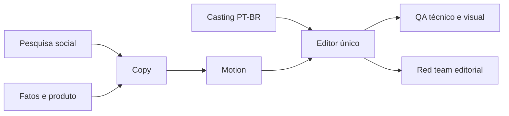

# Repo Reel Farm

Processo aberto para criar Reels curtos sobre repositórios com pesquisa rastreável, subagentes por função e revisão antes de publicar. O piloto de referência é a Hypit V4, guardada no projeto original. Este repositório contém **o processo e a farm**; os masters, vozes, credenciais e vídeos de terceiros ficam fora do Git.

## Começar

Requisitos: Python 3.11+, Git, FFmpeg, Node.js e um CLI de LLM (`codex` ou `claude`). Para renderizar, instale HyperFrames no projeto de episódio. Para usar Hypit, siga [docs/HYPIT.md](docs/HYPIT.md).

```powershell
git clone <URL-DESTE-REPOSITÓRIO>
cd repo-reel-farm
Copy-Item providers.example.json providers.json
Copy-Item episodes/example episodes/meu-video -Recurse
python farm.py episodes/meu-video --mock
python farm.py episodes/meu-video --provider codex
```

O primeiro comando testa apenas a orquestração. Antes da execução real, edite `episodes/meu-video/episode.json` e `BRIEF.md`. Em `providers.json`, você pode trocar o executável e os argumentos por qualquer LLM que receba prompt e devolva o contrato JSON. O processo usa argumentos como lista, sem executar texto de prompt em shell.

## Fluxo



A farm dispara tarefas independentes em paralelo, limita a concorrência e guarda o resultado por hash do contexto de cada papel. Arquivos de saída são conferidos por hash antes do reuso. Pesquisa e fatos expiram após 24 h; use `--force` se a fonte externa mudou antes disso. Uma falha bloqueia os dependentes. O editor é o único papel que recebe a raiz do episódio como workspace; os demais recebem `work/roles/<papel>`. O adapter da sua LLM deve restringir escrita ao workspace recebido. QA e red team devolvem correções; uma pessoa aprova voz, direitos e publicação. O JSON final separa `pipelinePassed` de `publicationReady`.

## Contrato dos agentes

Cada resposta deve ser JSON com `status` (`pass`/`fail`), `summary`, `evidence[]`, `outputs[]`, `issues[]`. Gates A/B exigem evidência. Cada episódio guarda o manifesto e o brief em Git; `work/`, `delivery/`, `assets/` e `private/` são ignorados. Links de fonte devem apontar para a prova específica. Exemplos ilustrativos devem ser identificados.

## Organização

| Caminho | Uso |
| --- | --- |
| `farm.py` | Orquestrador e cache por hash. |
| `providers.example.json` | Adaptadores Codex/Claude; copie para `providers.json`. |
| `episodes/example/` | Modelo editável de pauta. |
| `episodes/04-qm/` | Próximo piloto, em produção local. |
| `experiments/hypit-qm/` | Prova Hypit editável, renderizada localmente em QM. |
| `docs/PROCESSO.md` | Processo editorial e QA. |
| `docs/HYPIT.md` | Integração e teste do Hypit. |

## Estado

Em 28/09/2026, a Hypit V4 é um render local para avaliação, separado do V3 publicado. A V4 mostra trechos do vídeo real de Reddit, mas ainda requer escuta em celular e confirmação de direito de uso público do trecho. O piloto QM usa a próxima pauta numerada do lote (04/14), sem aprovação de publicação. A prova técnica Hypit de QM foi renderizada: [manifesto e instruções](experiments/hypit-qm/README.md), 8 s, 540×960/30 fps, sem créditos pagos. Ela não é o Reel final.

O código da farm e a documentação geral usam MIT. O experimento `experiments/hypit-qm/` adapta um exemplo oficial do Hypit e segue a [licença própria do Hypit](experiments/hypit-qm/LICENSE-HYPIT.txt); confira suas condições antes de redistribuir ou oferecer como serviço.

Este Git local será publicado após o QA do piloto e da integração. Não publique `delivery/`, assets licenciados, tokens ou conversa privada sem checar direitos.
